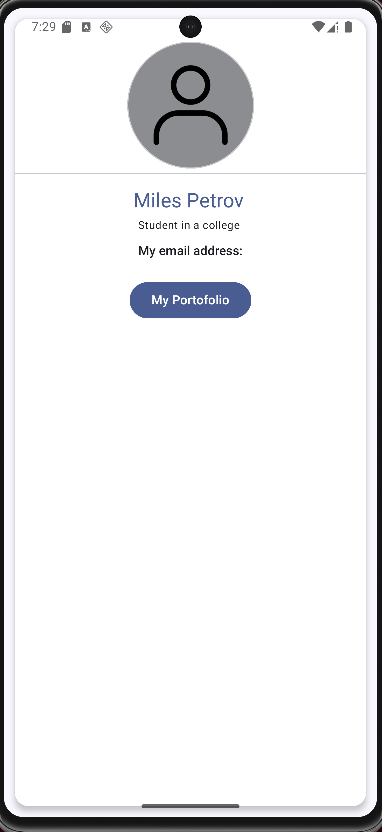
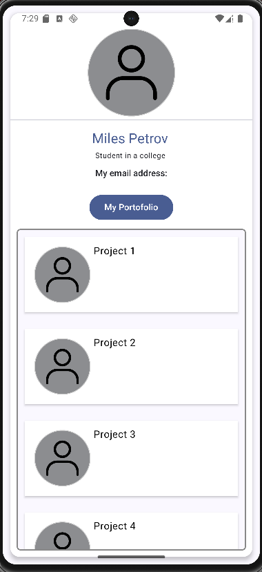

# 📇 JetBizCard

JetBizCard este o aplicație simplă de tip business card creată cu **Jetpack Compose** în Android Studio, ca proiect de învățare.

Aplicația permite afișarea unei imagini de profil, a informațiilor personale și a unui portofoliu de proiecte care poate fi ascuns/afișat cu un buton.

---

## 🎓 Proiect bazat pe cursul:

[👉 Kotlin Android: Jetpack Compose | The Modern Android Development](https://www.udemy.com/course/kotling-android-jetpack-compose-/learn/lecture/29297360#overview)  
_Curs disponibil pe Udemy_

---

## 🛠️ Tehnologii folosite

- Componente Compose:
  - `Card`, `Surface`, `Button`, `Text`, `Image`
  - `Column`, `Row`, `Box`, `LazyColumn`
  - `HorizontalDivider`
- Modificatori: `Modifier.padding`, `Modifier.fillMaxWidth`, `Modifier.size` etc.
- Gestionare stare cu `remember { mutableStateOf(...) }`
- Previziune UI cu `@Preview`

---

## 📱 Capturi de ecran

| Profil | Portofoliu |
|--------|------------|
|  |  |

> Imaginile sunt în folderul `screenshots/`.

---

## 📄 Licență

Distribuit sub licența [MIT](LICENSE).

---

> Made with ❤️ by Enache Victor in Kotlin & Jetpack Compose